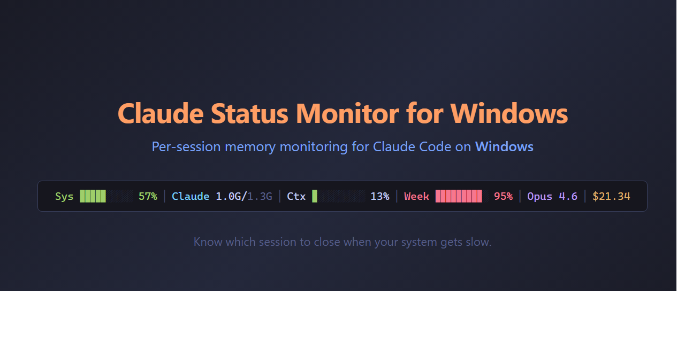

**English** | [繁體中文](README.zh-TW.md)

# Claude Status Monitor for Windows

A system-tray app for [Claude Code](https://docs.anthropic.com/en/docs/claude-code) on Windows, with two tools that tend to matter once you're running more than one session:

- **Statusline memory monitor** — shows per-session memory in your Claude Code statusline, so you can tell which `claude.exe` is eating all the RAM. Windows-specific.
- **Local memory API + `mmsg` CLI** — lets sessions survive context compaction and coordinate through short `topic-id`s instead of copy-pasted transcripts. Cross-platform.



---

## Part 1 — Statusline memory monitor

### The Problem

You're running 3-4 Claude Code sessions on Windows. System gets slow. You open Task Manager — all you see is multiple `claude.exe` processes. Which one is eating all the memory? No way to tell.

### The Solution

```
Claude 812M/1.5G (session/total)
       ↑              ↑
  This session    All sessions
```

**This is the core.** Each Claude Code session's statusline shows how much memory *this session* uses vs. the total across all sessions. See a heavy one? Close it. Problem solved.

Everything else — system memory %, context window, weekly usage, model name, cost — is bonus info you can toggle on/off from the system tray.

### Why a Separate Service? Why Not Just a Shell Script?

Good question. We tried that first. Here's why it doesn't work on Windows:

**Claude Code's statusline has a ~500ms timeout.** If your script doesn't finish in time, nothing shows.

On Windows, every process spawn is expensive:

| Operation | Time |
|-----------|------|
| `wmic` query (1 call) | ~150-300ms |
| `curl` to localhost | ~650ms (process spawn overhead) |
| `cat` via pipe | ~230ms |
| `bash` startup + pipe | ~250ms |

To display per-session memory, the statusline script would need to:

1. Walk the parent process chain to find which `claude.exe` owns this session — **multiple `wmic` calls, ~300ms each**
2. Query that process's memory — **another `wmic` call, ~150ms**
3. Query system memory — **another `wmic` call, ~150ms**

**Total: easily 1-2 seconds. Way over the 500ms limit.**

#### Our solution: split the work

| | Heavy work (background) | Statusline (fast path) |
|---|---|---|
| **Who** | Tray app (Node.js) | Bash script |
| **When** | Every 5 seconds | On each assistant reply |
| **What** | `wmic` queries for all sessions | `/dev/tcp` to localhost |
| **Time** | ~300ms (doesn't matter) | **~60ms** (well under 500ms) |

The tray app does the slow `wmic` work in the background and caches results. The statusline just reads cached data via a fast local HTTP call (`/dev/tcp`, no `curl` spawn). First call caches the PID, subsequent calls are ~60ms. The statusline bash script itself has **zero runtime dependencies** — no curl, no jq.

**Bonus:** the tray app also gives us a visible process (not a ghost), configurable items via right-click menu, and a clean way to start/stop.

> **On macOS/Linux** this split wouldn't be necessary — process queries are fast and the statusline script could do everything inline. Part 1 is a Windows-specific solution for Windows-specific problems. Part 2 below is where the cross-platform value is.

### Statusline items

| Item | Description | Default |
|------|-------------|---------|
| System Memory | RAM usage % with progress bar | On |
| Claude Memory | This session / all sessions total | On |
| MCP Memory | MCP server processes total + count | On |
| Context Window | Context usage % with progress bar | On |
| Weekly Usage | 7-day API usage % with progress bar | On |
| Session ID | Full UUID for session resume | On |
| Project Path | Project root directory | On |
| Model Name | Current model (e.g., Opus 4.6) | Off |
| Session Cost | Cumulative cost in USD | Off |
| Lines +/- | Lines added / removed this session | Off |
| Session Duration | Elapsed wall time | Off |

Toggle items on/off from the tray icon — changes apply instantly.

---

## Part 2 — Memory API + `mmsg` CLI

### The Problem

You've been pairing with a Claude Code session for hours. Context fills up and compacts — and Claude has "forgotten" half the decisions you made that afternoon. Or the session crashes outright. Or you're running two sessions in parallel — a planner and a worker — and need them to coordinate, so you end up copy-pasting long transcripts between terminal windows.

Claude Code's own `.jsonl` log preserves the raw history, but re-reading megabytes of it isn't the same as restored working memory, and `--resume` isn't always enough.

### The Solution

A small local HTTP API that the tray app exposes at `/api/*`, plus a zero-dependency `mmsg` CLI. Data lives in a SQLite file under the repo (`data/memory.db`, WAL mode, gitignored).

**Session survives crashes / compaction:**

```bash
# mid-session, before context gets tight: write a structured snapshot
mmsg snapshot <<'EOF'
{ "current_task": "refactor commission wallet",
  "next_steps": ["run e2e tests", "update CHECKLIST.md"],
  "blockers": [],
  "modified_files": ["src/modules/.../wallet.ts"] }
EOF

# session dies or compacts. a fresh session picks up with one command:
mmsg recovery
# → Markdown report: snapshot + last 10 user prompts + last 20 file edits
#   reads in 5 seconds instead of a 10MB raw .jsonl transcript
```

**Two sessions coordinate with one short id:**

```bash
# planner session
TOPIC=$(echo "plan TODO-19 removal" | mmsg topic-new --title="TODO-19" --author=planner)
echo $TOPIC   # → t-a7b3f9c2  — paste this one id to the worker session

# worker session reads + replies
mmsg topic-show t-a7b3f9c2
echo "acknowledged — auditing X now" | mmsg topic-add t-a7b3f9c2 --author=worker

# planner catches up later
mmsg topic-show t-a7b3f9c2
```

No shared files to edit in lock-step. No copy-pasting long prompts. Just an 8-character id.

### Cross-platform

The Memory API, `mmsg` CLI, and UserPromptSubmit hook use only Node built-ins + filesystem reads of `~/.claude/projects/*.jsonl`. They work on **Windows, macOS, and Linux**. Only the `/status/*` statusline monitor (Part 1) is Windows-specific.

### Endpoints

All routes are rooted at `http://127.0.0.1:19823/api` and return JSON. Errors use a consistent shape: `{ "error": { "code": "...", "message": "..." } }`. HTTP status codes follow the normal conventions (400 / 404 / 413 / 500).

| Route | Purpose |
|-------|---------|
| `GET  /api/health` | DB + server liveness |
| `GET  /api/stats` | Row counts per table |
| `POST /api/sessions` | Upsert session metadata |
| `GET  /api/sessions` | List (recent first) |
| `GET  /api/sessions/current?cwd=<path>` | Resolve the session id owning a working directory (reads `.jsonl` — no `wmic`) |
| `GET  /api/sessions/:id` | Detail |
| `POST /api/sessions/:id/snapshots` | Write a recovery snapshot (auto `snapshot_seq`) |
| `GET  /api/sessions/:id/snapshots/latest` | Latest snapshot, `summary_json` inflated to object |
| `GET  /api/sessions/:id/snapshots` | All snapshots, ascending |
| `GET  /api/sessions/:id/recovery` | Bundle: session + latest snapshot + recent prompts + recent file edits |
| `POST /api/sessions/:id/prompts` | Record prompt preview (first 200 chars only) |
| `POST /api/sessions/:id/file-edits` | Record a file operation |
| `POST /api/topics` | Create topic. Optional `first_message` → atomic topic + message |
| `GET  /api/topics` | List. Filters: `?status=active&recent=24h&limit=50` |
| `GET  /api/topics/:id` | Full thread. Options: `?latest=N` / `?since=<seq>` / `?summary=true` |
| `POST /api/topics/:id/messages` | Append message (auto-incremented `seq`) |
| `POST /api/topics/:id/close` | Mark closed (data preserved) |

Quick curl check:

```bash
curl http://127.0.0.1:19823/api/health
curl -X POST http://127.0.0.1:19823/api/topics \
     -H 'Content-Type: application/json' \
     -d '{"title":"hello","first_message":"opening line"}'
# → { "id": "t-xxxxxxxx", "topic": {...}, "first_message": { "seq": 1 } }
```

### `mmsg` CLI reference

Zero-dependency Node CLI, shipped as `bin/mmsg.cmd` on Windows. Add `bin/` to `%PATH%` (or copy `mmsg.cmd` to a directory already on `%PATH%`) and the command is available everywhere.

| Command | Purpose |
|---------|---------|
| `mmsg topic-new --title=<s> [--author=<s>]` | Create a topic. stdin becomes `first_message`. **Prints only the topic id** — shell-friendly: `TOPIC=$(mmsg topic-new --title=x)` |
| `mmsg topic-add <topic-id> [--author=<s>]` | Append a message (stdin content). Prints `ok seq=N` |
| `mmsg topic-show <topic-id> [--latest=N] [--since=<seq>] [--summary]` | Formatted thread |
| `mmsg topic-list [--status=active] [--recent=24h]` | Tabular listing |
| `mmsg snapshot [--session=<id>] [--at-prompt=<n>]` | Save a recovery snapshot. stdin must be valid JSON |
| `mmsg recovery [--session=<id>] [--json]` | Markdown recovery report (or JSON with `--json`) |
| `mmsg help [command]` | Help |

Session resolution for `snapshot` / `recovery`: `--session=<id>` beats `/api/sessions/current?cwd=<pwd>` beats a friendly error (exit 2).

Exit codes: `0` ok / `1` API error / `2` usage error / `3` server unreachable. Override the port with `MINITOR_PORT=<n>`.

### Calling `mmsg` from inside a Claude Code session

When Claude invokes `mmsg` through its Bash tool, Claude Code will prompt for permission on every call by default. That's a deliberate safety posture, not a bug — but it also interrupts flow if Claude is doing a handoff or snapshot mid-task. You have three ways to deal with it, pick what matches your comfort level:

**1. Accept the prompts.** Safest default. Zero config. You approve each `mmsg` call explicitly. Downside: the prompt breaks flow every few minutes in agent-heavy workflows.

**2. Project-scoped allow rule.** In a given project's `.claude/settings.local.json` (gitignored by convention), add:

```json
{
  "permissions": {
    "allow": [
      "Bash(mmsg:*)",
      "Bash(<path-to-repo>/bin/mmsg.cmd:*)"
    ]
  }
}
```

Scope stays narrow (this project only). Best trade-off for most people.

**3. User-global allow rule.** Same pattern, written to `~/.claude/settings.json` — applies to every Claude Code session on this machine. Most convenient, broadest trust.

Read the rules the way Claude Code does: `Bash(mmsg:*)` allows commands whose prefix is literally `mmsg` followed by any arguments — **not** a wildcard for arbitrary shell. The CLI itself only talks to `127.0.0.1:19823` and cannot reach the network, so the blast radius is whatever operations the Memory API exposes (list / read / write topics and snapshots on your own machine).

We default to no preset. Each user makes this call explicitly.

### Why not an MCP server?

Fair question — MCP is the obvious path for "let the agent call this tool without shell prompts." We considered it and decided against shipping one for now:

- **stdio MCP** (the common transport) would spawn a dedicated Node process per Claude Code session. That's per-session memory overhead, and once running it's an invisible background process — ironic for a repo whose whole pitch is "know what your Claude processes are eating."
- **HTTP/SSE MCP** could reuse the running tray app (zero new processes), but we haven't verified Claude Code's current remote-MCP behavior end-to-end, and we'd rather not ship a config we can't stand behind.

If you want MCP anyway, the existing `/api/*` HTTP surface is a close fit — a thin wrapper turning `mcp__minitor__*` tool calls into HTTP requests would be ~150 lines. PRs welcome.

### Optional: UserPromptSubmit reminder hook

Claude Code runs this hook before every user prompt. The reminder hook nudges you to `mmsg snapshot` every 10 user prompts (per session, diff-based — so JSONL gaps and re-runs don't cause false skips or doubled reminders). It is **not** installed automatically — paste this into `~/.claude/settings.local.json` (or a per-project `.claude/settings.local.json`) when you want it:

```json
{
  "hooks": {
    "UserPromptSubmit": [
      { "matcher": "",
        "hooks": [
          { "type": "command",
            "command": "node <repo>/tools/session-prompt-reminder.js" }
        ] }
    ]
  }
}
```

Hook counting notes (for contributors):

- The hook counts `"type":"last-prompt"` events in the session's JSONL — each user prompt produces exactly one. It does **not** use `messageCount` (which lives in `turn_duration` events and is a cumulative count of internal messages: tool_use / assistant / tool_result / …, jumping by dozens per turn — `count % 10 == 0` would miss entire windows).
- Deduplication is diff-based: `~/.claude-monitor/reminder-state.json` records the last reminded count per session, and we remind only when `count - last >= 10`. JSONL gaps can't silently skip a window, and re-running the hook on the same prompt never double-reminds.
- The hook is wrapped in a double try/catch and always exits 0 silently on error — it must not block a user prompt.

### Data & configuration

- **Database**: `<repo>/data/memory.db` by default. Override with `MINITOR_DB_PATH`. WAL mode is on. The `data/` directory is in `.gitignore`.
- **Port**: `19823`, bound to `127.0.0.1` only. CLI port override: `MINITOR_PORT=<n>`. (Changing the server port still requires editing `monitor/app.js`.)
- **Data minimization**: `prompts.text_preview` keeps only the first 200 characters; file paths are normalized and capped at 1024 characters; no other prompt content is persisted.

### Build requirements

The API uses [`better-sqlite3`](https://github.com/WiseLibs/better-sqlite3) for its synchronous API. On most Windows 10/11 setups `npm install` grabs a prebuilt binary and no compilation is needed. If prebuilt isn't available for your Node version, `node-gyp` falls back to a native build and you'll need:

- Visual Studio 2019+ Build Tools (C++ workload), **or**
- `npm install --global windows-build-tools` (older setups).

As a zero-compile alternative, swap to [`sqlite3`](https://www.npmjs.com/package/sqlite3) (async) and convert `monitor/db.js` to Promise-based DAOs. Everything else is unchanged.

### Smoke tests

```bash
node monitor/test/smoke-db.js    # DAO + migrations + idempotent init
node monitor/test/smoke-api.js   # All /api/* endpoints, in-process server, ephemeral port
node monitor/test/smoke-cli.js   # mmsg CLI via child_process
node monitor/test/smoke-hook.js  # UserPromptSubmit reminder against a fake HOME
```

These use temp directories and ephemeral ports and never touch your running tray app or real DB.

---

## Multi-session workflow (optional)

Running two or three Claude Code sessions in parallel — a "main" session orchestrating and "sub" sessions doing focused work — turns into a coordination problem: who's working on what, how does a sub-session report back, how does a fresh session pick up after a crash. Minitor's topic/snapshot primitives are the machinery; the *patterns* for using them live in [`docs/rules/`](docs/rules/README.md).

The canonical rule is [`multi-session-dispatch`](docs/rules/multi-session-dispatch.md): Type 1 (session-memory) vs Type 2 (dispatch) topics, the 4-part user-facing report format, race handling, a new-user onboarding checklist. Rules are discoverable and readable without leaving the terminal:

```bash
mmsg rules list                         # all active rules
mmsg rules show multi-session-dispatch  # print the rule body
```

Other projects that use Minitor as their multi-session runtime can reference these rules from their own `CLAUDE.md` with `mmsg rules show <name>` rather than hardcoding an absolute path — the rules dir stays the single source of truth.

---

## Quick Install

**Prerequisites:** Node.js 18+, Git Bash (comes with [Git for Windows](https://git-scm.com/))

### Basic — statusline memory monitor

```powershell
git clone https://github.com/user/claude-status-monitor-4-windows
cd claude-status-monitor-4-windows
.\install.ps1
```

That's it. The installer:

1. Installs npm dependencies (including `better-sqlite3` for the Memory API)
2. Copies the statusline script to `~/.claude/`
3. Configures Claude Code's `settings.json`
4. Creates a startup shortcut (auto-launch on boot)
5. Starts the tray app
6. Verifies `/api/health` and prints `mmsg` CLI / hook setup hints

Open a Claude Code session and the statusline appears. For the `mmsg` CLI, add `bin/` to your `%PATH%` or copy `bin/mmsg.cmd` to a directory already on `%PATH%` (the installer's output tells you how). Re-running `install.ps1` is safe — it stops the running monitor on port 19823 first, refreshes installed files, and restarts.

### Advanced — cross-session coordination

If you want the full Multi-session workflow (Phase 7 transcript recording + recovery reports for session handoff):

1. Run `install.ps1` (above) so the tray app is up.
2. Put the three-hook block from the [Optional: UserPromptSubmit reminder hook](#optional-userpromptsubmit-reminder-hook) section — plus the `UserPromptSubmit` / `Stop` / `PostToolUse` triple for `tools/hook-forward.sh` — into your `~/.claude/settings.json` (or a per-project `.claude/settings.local.json`). See [`docs/rules/multi-session-dispatch.md`](docs/rules/multi-session-dispatch.md) §10 for the exact JSON.
3. Restart any open Claude Code sessions so they pick up the hooks.
4. Verify: after a short session, `mmsg recovery` should print a Markdown report with real `Recent transcripts` and `Recent file ops`.

## How It Works

```
┌─ System Tray App (Node.js, 127.0.0.1:19823) ───────────────────────────┐
│                                                                         │
│  Tray Icon (bottom-right)        Background wmic collector (60s)        │
│                                                                         │
│  HTTP server                                                            │
│    /status/*   Windows-only statusline data (wmic-backed in-memory)     │
│    /api/*      Cross-platform Memory API (SQLite-backed)                │
│                                                                         │
│  SQLite  <repo>/data/memory.db  (WAL mode)                              │
│    sessions / prompts / file_edits / snapshots                          │
│    topics / topic_messages                                              │
│                                                                         │
│  Config  ~/.claude-monitor/                                             │
│    config.json          (which statusline items to show)                │
│    reminder-state.json  (last reminded prompt count per session)        │
└─────────────────────────────────────────────────────────────────────────┘
         ▲ /dev/tcp                ▲ http.request                ▲ fs read
         │ (~60ms)                 │                             │
┌─ Statusline (bash) ──────┐  ┌─ mmsg CLI (Node) ─────────┐  ┌─ Hook (Node) ────────┐
│ runs every assistant     │  │ runs on demand           │  │ runs before every    │
│ reply. Reads cached      │  │ talks to /api/*          │  │ user prompt.         │
│ memory + display config. │  │ topic-new / topic-add /  │  │ Counts last-prompt   │
│ Assembles colored ANSI.  │  │ topic-show / snapshot /  │  │ events in .jsonl;    │
│                          │  │ recovery.                │  │ reminds every 10.    │
└──────────────────────────┘  └──────────────────────────┘  └──────────────────────┘
```

## Configuration

### Toggle Items

Right-click the tray icon to check/uncheck statusline items. Changes are instant and persist across restarts.

### Manual Config

Config is stored at `~/.claude-monitor/config.json`:

```json
{
  "sys_mem": true,
  "claude_mem": true,
  "ctx": true,
  "week": true,
  "session_id": true,
  "path": true,
  "model": false,
  "cost": false
}
```

### Port

The tray app uses port `19823` on localhost. To change it, edit the `PORT` constant in `monitor/app.js`. The `mmsg` CLI picks up `MINITOR_PORT` from the environment if you want to point it elsewhere temporarily (useful for testing).

## Uninstall

```powershell
.\uninstall.ps1
```

Removes: startup shortcut, statusline config, monitor config. The SQLite DB (`data/memory.db`) and project files remain — delete them manually if you don't want them.

## Troubleshooting

### Statusline

**Statusline shows `?` or nothing**
- Check if the monitor is running (look for the orange tray icon).
- Start it manually: double-click `monitor/start.vbs`.

**Statusline shows `offline`**
- The monitor API is not reachable. Restart it from the tray or `start.vbs`.

**First statusline render is slow**
- Normal. The first call discovers your session's PID (~300ms). Subsequent calls are ~60ms (cached).

**Tray icon doesn't appear**
- It may be in the overflow area. Click the `^` arrow in your taskbar to check.

### Memory API / `mmsg` CLI

**`mmsg` prints `Minitor tray app not running`**
- The tray app is down. Start it: double-click `monitor/start.vbs`, or re-run `install.ps1`.

**`mmsg` hangs or times out**
- Something else is holding port 19823. Check with `netstat -ano | findstr 19823` and stop the offender.

**UserPromptSubmit reminder never fires**
- Confirm the hook is actually configured: `cat ~/.claude/settings.local.json` and look for the `UserPromptSubmit` block (see the hook section above).
- Reminders fire every 10 user prompts per session. Delete `~/.claude-monitor/reminder-state.json` to reset counters.
- Hook errors are swallowed by design (it must not block a prompt). Test manually: in a project directory with an existing Claude Code session, run `node <repo>/tools/session-prompt-reminder.js` — at the right count it will print the reminder to stdout.

## Requirements

- Windows 10/11 (for the statusline monitor and tray app)
- Node.js 18+
- Git Bash (Git for Windows) — for the statusline script
- Claude Code CLI
- **Optional**: Visual Studio 2019+ Build Tools (C++ workload) if `better-sqlite3` can't fetch a prebuilt binary for your Node version (rare on current setups)

## License

MIT
